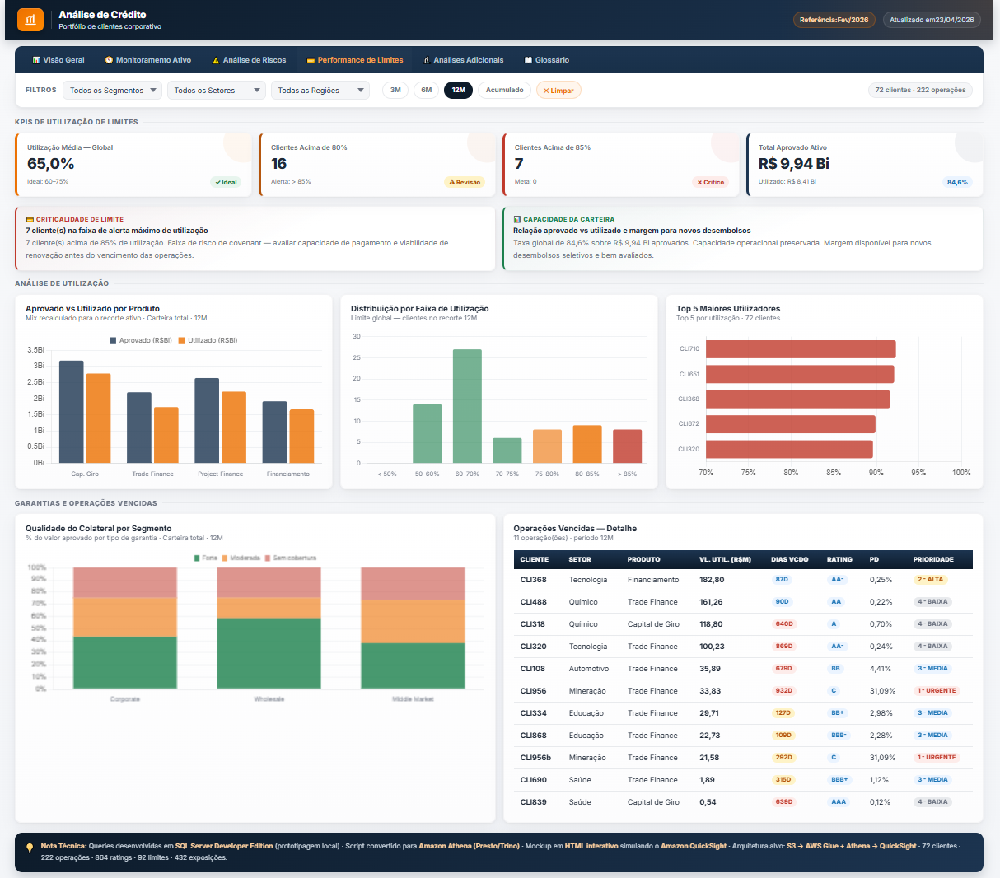

# Analise de Crédito

Pipeline de dados ponta a ponta para analise de portfolio de credito corporativo, construido como case tecnico com foco em 3 objetivos: ser didatico, funcional e reutilizavel.

## Visao Geral

Este repositorio cobre o fluxo completo:

`Excel -> Python ETL -> SQL em 3 camadas -> views analiticas -> dashboard executivo`

O desafio do projeto e transformar cinco tabelas de origem (`clientes`, `operacoes`, `ratings`, `limites`, `exposicoes`) em indicadores acionaveis para comite de credito, mantendo uma trilha clara do dado bruto ate o consumo analitico.

---



---

## Insights Do Dashboard

Esta visao do dashboard ajuda a responder perguntas de negocio como:

- qual e o nivel medio de utilizacao dos limites da carteira?
- quantos clientes ja estao acima das faixas criticas de 80% e 85%?
- quanto do limite aprovado ja foi consumido e qual margem ainda existe para novos desembolsos?
- quais produtos concentram maior uso de limite?
- quais clientes exigem monitoramento prioritario por alta utilizacao?
- como esta a qualidade do colateral e quais operacoes vencidas pedem acao imediata?

Principais contribuicoes para tomada de decisao:

- identificar clientes com pressao de limite e risco de renovacao
- medir a capacidade residual da carteira para novas aprovacoes
- priorizar revisao de limite, reforco de garantias e cobranca
- monitorar concentracao de utilizacao por produto e por cliente
- antecipar sinais de deterioracao operacional da carteira

Acesse o [Dashboard](https://igorpereirapinto.github.io/analise_de_credito/) publicado no GitHub Pages.

---

## O Que Este Projeto Resolve

- extracao e validacao estrutural da base Excel
- limpeza, padronizacao e testes em Python
- modelagem analitica em `raw`, `stage` e `dw`
- implementacao paralela para `SQL Server` e `Athena`
- consumo final em dashboard HTML e camada semantica para BI

---

## Como Navegar

Se voce quer ver o resultado final:

- abrir o [Dashboard](https://igorpereirapinto.github.io/analise_de_credito/)

Se voce quer executar o projeto:

- seguir [docs/como_executar.md](docs/como_executar.md)

Se voce quer aprender o projeto passo a passo:

- comecar por [roadmap/00_setup_local_e_git.md](roadmap/00_setup_local_e_git.md)

---

## Fluxo Do Projeto

```text
[1] Setup local e versionamento
    pasta do projeto -> Git -> VS Code -> ambiente virtual

[2] Entendimento do problema
    leitura das bases -> perguntas de negocio -> hipoteses -> definicao de KPIs

[3] Python ETL
    extracao -> limpeza -> validacao -> testes -> exportacao

[4] SQL analitico
    RAW -> STAGE -> DW -> queries analiticas -> camada semantica

[5] Consumo e comunicacao
    dashboard -> storytelling -> apresentacao executiva

[6] Reutilizacao
    ajuste de schema -> regras -> SQL -> dashboard -> documentacao
```

---

## Estrutura Do Repositorio

```text
analise_de_credito/
|-- README.md
|-- .env.example
|-- requirements.txt
|-- requirements-dev.txt
|-- run_etl.py
|-- data/
|   |-- raw/
|   `-- processed/
|-- python/
|   |-- README.md
|   |-- 01_extract.py
|   |-- 02_clean.py
|   |-- 03_validate.py
|   `-- 04_export.py
|-- sql/
|   |-- sqlserver/
|   |-- athena/
|   `-- extras/
|-- dashboards/
|   `-- dashboard_credito_bba.html
|-- docs/
|   |-- assets/
|   |   |-- dashboard-performance-limites.png
|   |   |-- dashboard-visao-geral.png
|   |   `-- dashboard-visao-geral.svg
|   |-- arquitetura.md
|   |-- como_executar.md
|   |-- dicionario_de_dados.md
|   |-- faq_reutilizacao.md
|   `-- regras_de_negocio.md
|-- roadmap/
|   |-- 00_setup_local_e_git.md
|   |-- 01_visao_geral_do_projeto.md
|   |-- 02_entendimento_do_case.md
|   |-- 03_analise_da_base_excel.md
|   |-- 04_arquitetura_do_pipeline.md
|   |-- 05_etl_extracao.md
|   |-- 06_etl_padronizacao_e_validacoes.md
|   |-- 07_modelagem_raw.md
|   |-- 08_modelagem_stage.md
|   |-- 09_modelagem_dw.md
|   |-- 10_sql_server_vs_athena.md
|   |-- 11_kpis_e_views_analiticas.md
|   |-- 12_dashboard_e_storytelling.md
|   |-- 13_apresentacao_executiva.md
|   `-- 14_como_reutilizar_o_projeto.md
`-- tests/
```

---

## Execucao Rapida

### 1. Clonar e preparar o ambiente

```bash
git clone https://github.com/IgorPereiraPinto/analise_de_credito.git
cd analise_de_credito
python -m venv .venv
```

Ative o ambiente virtual:

- Windows: `.venv\Scripts\activate`
- Linux/Mac: `source .venv/bin/activate`

Instale as dependencias:

```bash
pip install -r requirements.txt
pip install -r requirements-dev.txt
```

### 2. Configurar a entrada

```bash
copy .env.example .env
```

Coloque `dados_sinteticos_case.xlsx` em `data/raw/`.

### 3. Rodar o ETL

```bash
python run_etl.py
```

### 4. Validar com testes

```bash
pytest -q
```

### 5. Abrir o resultado final

- abrir o [Dashboard](https://igorpereirapinto.github.io/analise_de_credito/)
- ou abrir localmente `dashboards/dashboard_credito_bba.html`

Guia completo: [docs/como_executar.md](docs/como_executar.md)

---

## Roadmap Didatico

O `roadmap/` funciona como workflow do projeto, do primeiro passo ao ultimo:

1. [00_setup_local_e_git.md](roadmap/00_setup_local_e_git.md)
2. [01_visao_geral_do_projeto.md](roadmap/01_visao_geral_do_projeto.md)
3. [02_entendimento_do_case.md](roadmap/02_entendimento_do_case.md)
4. [03_analise_da_base_excel.md](roadmap/03_analise_da_base_excel.md)
5. [04_arquitetura_do_pipeline.md](roadmap/04_arquitetura_do_pipeline.md)
6. [05_etl_extracao.md](roadmap/05_etl_extracao.md)
7. [06_etl_padronizacao_e_validacoes.md](roadmap/06_etl_padronizacao_e_validacoes.md)
8. [07_modelagem_raw.md](roadmap/07_modelagem_raw.md)
9. [08_modelagem_stage.md](roadmap/08_modelagem_stage.md)
10. [09_modelagem_dw.md](roadmap/09_modelagem_dw.md)
11. [10_sql_server_vs_athena.md](roadmap/10_sql_server_vs_athena.md)
12. [11_kpis_e_views_analiticas.md](roadmap/11_kpis_e_views_analiticas.md)
13. [12_dashboard_e_storytelling.md](roadmap/12_dashboard_e_storytelling.md)
14. [13_apresentacao_executiva.md](roadmap/13_apresentacao_executiva.md)
15. [14_como_reutilizar_o_projeto.md](roadmap/14_como_reutilizar_o_projeto.md)

---

## Analise Do Projeto E Oportunidades De Melhoria

Pontos fortes atuais:

- boa separacao entre ETL Python, SQL, dashboard e documentacao
- existencia de suite de testes e runner unico (`run_etl.py`)
- trilha paralela `SQL Server` e `Athena`, o que aumenta reutilizacao
- dashboard publicado, o que melhora portfolio e demonstracao

Oportunidades de melhoria para ficar ainda mais didatico:

- transformar `roadmap/` em workflow universal, com setup local e Git antes da visao conceitual
- explicitar melhor no README o caminho para quem quer apenas ver o resultado e para quem quer estudar
- documentar, em cada etapa, o que e "editavel para reutilizacao" e o que e "infraestrutura fixa"
- adicionar um guia de perguntas de negocio antes do ETL, para reforcar pensamento analitico e nao so execucao tecnica
- incluir um checklist de entrada e saida por etapa, indicando quando a fase comeca e quando termina

Oportunidades de melhoria para ficar mais funcional:

- adicionar validacao automatica do `.env` e mensagens de erro mais guiadas
- criar um `Makefile` ou `tasks` equivalentes para rodar ETL, testes e verificacoes com um comando
- publicar um exemplo de saida esperada por etapa para facilitar debug

Oportunidades de melhoria para ficar mais reutilizavel:

- padronizar ainda mais os pontos de configuracao em constantes ou arquivos `.yaml`/`.json`
- separar melhor o que e regra de negocio do que e regra tecnica
- criar um template de "novo case" explicando quais arquivos devem ser clonados e quais devem ser reescritos

---

## Infraestrutura De Desenvolvimento

Os arquivos `CLAUDE.md`, `AGENTS_GUIDE.md`, `COMMANDS_GUIDE.md`, `SKILLS_GUIDE.md` e o diretorio `.claude/` sao artefatos de produtividade usados durante o desenvolvimento. Eles nao fazem parte da logica do case e podem ser ignorados ou removidos em outro contexto.

---

## Autor

**Igor Pereira Pinto**  
Analista de Dados / BI e Planejamento Comercial Senior  
[github.com/IgorPereiraPinto](https://github.com/IgorPereiraPinto)
